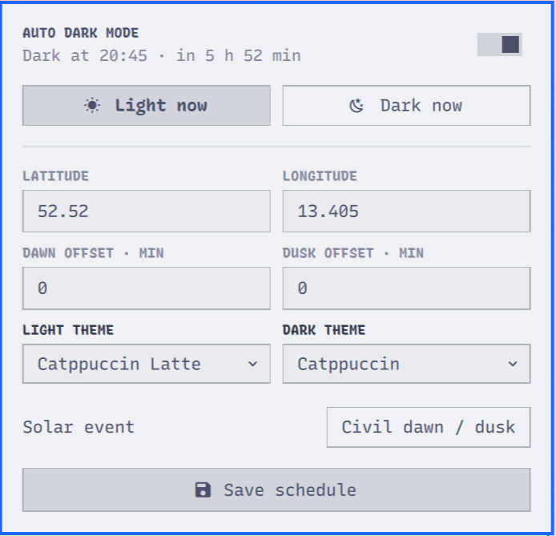

# Auto Dark Mode

Auto Dark Mode switches Omarchy between a chosen light and dark theme using
the local Sun angle. It runs entirely inside the Omarchy shell and performs
the astronomical calculation locally; coordinates are never sent anywhere.



## Install

```sh
omarchy plugin add https://github.com/digitalfrost84/omarchy-auto-dark-mode-plugin --enable
```

The plugin starts with automatic switching disabled and does not assume a
location. Click the new sun/moon icon, enter coordinates, choose themes, save,
and turn on **Automatic**.

## Configure

The popup provides:

- latitude and longitude
- independent morning and evening solar-elevation thresholds, in degrees
- light and dark themes selected from the themes installed in Omarchy

Middle-click the widget to re-evaluate immediately. Selecting **Light now** or
**Dark now** temporarily overrides automation until the next solar transition,
including across shell restarts.

The plugin remembers the last wallpaper used with each configured theme. A
theme switch restores that wallpaper instead of replacing a user-selected
background with the theme default. Omarchy's current-theme state remains the
source of truth, so restarting the shell or logging in again keeps the active
theme and does not reapply it merely because the plugin started.

### Choosing a Sun angle

The plugin has independent **Light at** (morning) and **Dark at** (evening)
angles. This makes the schedule follow latitude and season instead of applying
a fixed number of minutes to a solar event.

The default is **+3° / +3°: dark sooner and longer**. In the morning, light mode
waits until the Sun has climbed 3° above the horizon. In the evening, dark mode
starts when it falls below 3°. The values need not match: for example, Light at
`+5°` and Dark at `+2°` delays light mode further without making dark mode start
quite as early. Useful reference points for either field:

- `+6°` — substantially shorter light-theme day
- `+3°` — dark sooner and longer (default)
- `−0.833°` — approximately conventional sunrise and sunset
- `−6°` — civil dawn and dusk; includes civil twilight in the light-theme day
- `−12°` — nautical twilight; keeps the light theme even longer

A higher **Light at** angle delays light mode. A higher **Dark at** angle starts
dark mode earlier. The practical range accepted by the popup is `−18°` to
`+20°`.
At extreme latitudes the Sun may not cross the selected angle on a given day;
the plugin then keeps the corresponding theme until a crossing exists again.

If the shell is not currently running, enable the plugin after installation:

```sh
omarchy plugin enable digitalfrost84.auto-dark-mode
```

## Privacy and dependencies

The plugin uses no network services and adds no package dependencies. It runs
unsandboxed with normal user permissions, like all Omarchy shell plugins, and
only launches the local `omarchy theme list`, `current`, `set`, and `bg set`
commands, plus `readlink` to observe Omarchy's current background symlink.
Manual-override and per-theme wallpaper state is stored at
`~/.local/state/omarchy/auto-dark-mode.json`.

## Remove

```sh
omarchy plugin remove digitalfrost84.auto-dark-mode
```

Removal stops the service and removes the widget. The small manual-override
state file may be deleted separately if desired.

## Development

```sh
omarchy plugin validate ~/.config/omarchy/plugins/digitalfrost84.auto-dark-mode
/usr/lib/qt6/bin/qmllint -I /usr/share/omarchy/shell ~/.config/omarchy/plugins/digitalfrost84.auto-dark-mode/*.qml
node tests/test-solar.js
```
